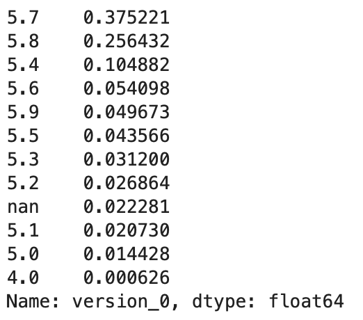

# Data reporting from currently collected Zoom Api data

### Findings:
 - it is most likley fine to keep only users 0-2, and remove all other features of later users to reduce data complexity
 - generally it is likely safe to assume that user 0 is the host, and other users are not in data reports
 - be aware that a significantly larger amount of "unknown" device counts exist for users 1 and 2. Explanations are found below. 
 - similarly, a larger proportion of NaN values appear for version display for users 1 and 2

### Contents of report:
1. User metadata
2. User analysis
3. Device analysis
4. Zoom Version analysis

## 1: User metadata
Status of data table:
- number of entries: 113461
- number of unique meeting_id values: 112527 
- date range of virtual visits: 6/23/2021 to 1/22/2022

Number of meetings per month is about 15,000 - 17,000 (note: only a few days of month 06 exist, not a representative sample)

## 2. User analysis
#### How many users should we keep?
- The database stores features for user_n ranging from 0 to 8. This is to account for a relatively very few times that users signed out and back in again multiple times. In terms of how much data needs to be uploaded to microstrategy, we can see a sharp increase in the number of null values after user 2. It is therefore likely safe to drop users after user 3 to conserve storage size and complexity of data, especially given that the raw data will be preserved via AWS.

#### Host analysis
Zoom api is technically agnostic to who each user is, registering the first person to sign in as "user_0" and incrementing each subsequent user to sign in (including those who sign in repeatedly by switching devices, getting disconnected, etc) However, it can be safely assumed that user_0 is the host in the vast majority of cases, and that user 1 and 2 are not. A breakdown of the users who are/are not hosts is as follows: 

    - user 0: 97.6% are the host, 2.3% are not (this is still 2631 entries)
    - user 1: 3.9% are the host, 96% are not the host (still over 4000 entries are the host)
    - user 2: 4.59% are the host, 95.4% are not the host (still over 5000 entries are the host)

#### Conclusion:
    - it is generally most effective on balance to retain only users 0-2. In addition, it is generally safe to assume that user 0 is the host if most circumstances, and that users 1 and 2 are not. 

## 3. Device analysis
Across the 3 users we are keeping from above, here is a breakdown of each device count. There is both a raw count and a proportion of all users counted. First, user 0 (or generally host users):

Here is user 1. Note the larger number of "unknown" devices:
 

and user 2:

 

The larger number of unknown device counts is not represented in user 0. After investigating, [this zoom forum](https://devforum.zoom.us/t/device-type-of-unknown/70849/4) resolved this as a known issue in Zoom. Essentially, if a user who joins a zoom meeting does not sign in, but rather simply enters as a "guest," then zoom will not collect or store the user metadata, and therefore the device will be registered as "unknown." This makes sense, as we would expect the host, or the BCH care team, to be signing in on a much higher level to their accounts when initiating virtual care with their patients, while the patients themselves have no obligation or necessity to do so. 

It should therefore be interpreted that unknown device users simply do not have or did not utilize a zoom account sign in, and if you wish to get a ratio or count of all devices, these should most likely be excluded. However, if there is an interest in encouraging patients to sign in to accounts, this could be a useful metric for following the trend of patients who sign in vs those who don't. 

4. Zoom version analysis
- Note: Zoom versions as reported in the api often offer results specific to a level we do not necessarily need (or likley would understand) - such as 5.7.7.1105. I am keeping therefore only the first decimal, and would represent this as version 5.7 (this is also what I did in microstrategy in my preliminary analysis). These are presented as proportions of all users.

#### User 0

#### User 1

#### User 2

Note, again, that there are high proportions of null values for users 1 and 2. This is, again, due to the reasons above, as this is metadata collected from users who signed in with a zoom account. There remains enough data to analyze user versions, however the same considerations as above should be applied when seeking to analyze the data. 